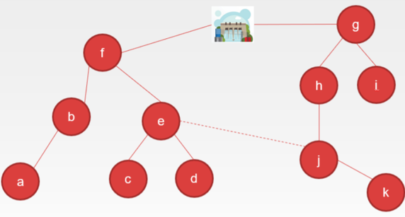

# Power Grid
## Semester Assignment 2

### Scenario
A power company is building a power grid in the town of Flåklypa.
All houses which is in need of electricity has to be connected to the power grid, and a plan must be in place in case of power outages.
In this semester assignment your job is to aid in the development of this power grid. In reality such a grid would be built using a variation of different power cables dependent on the power needs of the respective parts of the grid. In this assignment we simplify the task by saying there is only one type of power cable and that it does not matter how many houses are connected though the same cable. Implement ``IProblem``.

### Task 1
The power company has gathered information on all the houses which needs to be connected to the grid. In addition, they have mapped for each pair of connected houses how expensive the cable between them will be. This has been modelled as a weighted graph where each node is a house and a cable between houses is an edge with a weight for cost of that cable. The company wants to construct the power grid with the smallest cost possible while supplying all houses with electricity. Which cables should be used in the network?

This problem in literature is known as *Minimum Spanning Tree*, see chapter 4.3 in *Algorithms*.

**Implement ``IProblem::mst``.** By passing ``ProblemSolverMSTTest`` you will get full points for functionality. To get full points for the task your solution also has to be efficient.

### Task 2
After the power grid has been built the power company has recieved a number of inquiries about power outages. Modern power grids often have an automatic alert system telling us where in the network the cause of the outage is located, but our power grid does not have such a system. Often times when a power outage occurs several houses loose power at the same time. A power outage can be seen as an edge of the network being removed. The nodes that are still part of the connected component with the power plant are recieving electricity, while all other nodes are not recieving electricity. To find the source of the outage as fast as possible we need to find the node of the network next to the cable which is most likely to have been the cause of the fault in the power grid, and start the error search from there. When two messages, from two seperate houses, about the outage has been recieved it is safe to assume that it comes from the same error in the network. Hence, the error must be in a cable that connected both these houses to the power plant. 

Given two nodes ``u`` and ``v`` find a node to conduct the outage search from. The error must have occurred in a cable which connects both nodes to the same connected component as the power plant. This problem in the litterature is called *Lowest Common Ancestor* (LCA). The optimal datastructure for LCA (which you can find by googling) is not part of the INF102 curriculum. You are not required to implement the optimal algorithm, but rather you are to implement a simple algorithm. It is possible to find a solution which runs in *O(n)*.

**Implement ``IProblem::lca``.** By passing ``ProblemSolverLCATest`` you will get full points for functionality. To get full points for the task your solution also has to be efficient.

### Task 3
After many complaints the power company has realised that the cheapest solution is not always the best. In a new attempt to solve the problem they will be adding an extra cable (an extra edge) to the network (graph). The goal is to have an outage impact the least amount of houses. One faulty cable can cause a large number of houses to lose power. You are to find a pair of nodes which by adding a cable between them will minimize the number of houses affected if another cable fails. 

In this task it is possible to write an algorithm which runs in *O(n4)*, but to get full score on this task your solution must have a much better runtime.

In the example above if the edge between the **power plant** and node **f** fails then 6 nodes will lose access to electricity. If we add an edge between **e** and **j** this problem will be averted as all nodes will still be in the same connected component as the **power plant**. Then the largest power outage that can occur (removal of one edge) is 2 (the edge between **f** and **b** fails).

**Implement ``IProblem::addRedundant``.** By passing ``ProblemSolverREPTest`` you will get full points for functionality. To get full points for the task your solution also has to be efficient.

## Grading
This mandatory assignment will count 15 % towards your final grade. You will recieve a score between 0 and 15.
The following rubric will be used to assess you assignment:

### Code Quality
Code quality gives 0-3 points.
 * The code must be clear and readable
 * Avoid repetition of code
 * Utilize concepts from INF101 to write maintainable and modular code

### Runtime Analysis (svar.md)
Runtime analysis gives 0-3 points.
 * Every method you use must have a runtime analysis using Big-O notation. You get points if the runtime is correct, but a reduction in score if it is incorrect. 
 * The runtime analysis must be written in svar.md. In addition to Big-O notation you must add a description of why the method has this runtime.
 * The runtime should be expressed using three parameters
    * ``m`` - number of edges in the graph
    * ``n`` - number of nodes in the graph

### Functional and Efficient Algorithms and Datastructures
Correct and appropriate use of algorithms and datastructures gives 0-9 points.
The goal of this task is to write algorithms that both correct and the code runs as efficiently as possible. In this task you will need to use algorithms and datastructures you have learned in this course, for instance: ``LinkedList``, ``ArrayList``, ``HashMap``, ``PriorityQueue``, etc. We will look at every method you have implemented and assess if you have done this as efficiently as possible.

 * **Task 1** gives 0-3 points.
    * We will assess if your implementation is functionally correct
    * We will assess whether the methods and classes implemented to complete the task are written as efficiently as possible
 * **Task 2** gives 0-3 points.
    * We will assess if your implementation is functionally correct
    * We will assess whether the methods and classes implemented to complete the task are written as efficiently as possible
 * **Task 3** gives 0-3 points.
    * We will assess if your implementation is functionally correct
    * We will assess whether the methods and classes implemented to complete the task are written as efficiently as possible

